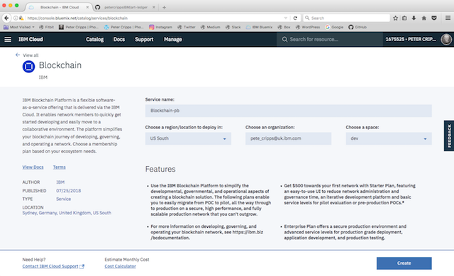

# Step 2: Create IBM Cloud Services
You'll need an IBM Cloud account for this which you can get [here](https://console.bluemix.net/registration/).

Once you have an account and are signed in you need to create a new blockchain instance. From the IBM Cloud dasboard select `Create resource` (button at the top right). Type 'blockchain' in the search window and press enter. The IBM Blockchain service appears twice, select either one and this window will appear.



Give your network a name (I'm using 'Blockchain-Art-Ledger') and press `Create`. After a few seconds this screen will appear.


Once your blockchain service is up and running you can go to the monitor and browse what you have. The Starter Plan gives you two company/organisations, each with a single peer and CA and one ordering service. There is a default channel shared by the peers. If you look at the default channel you will see it has a block height of 3 corresponding to the three transactions that have taken place to create the network.

More information on Hyperledger Fabric can be found in the [Hyperledger Fabric ](http://hyperledger-fabric.readthedocs.io/en/latest/index.html) documentation.

A *Connection Profile* is used by Hyperledger Composer and other client programmes to connect to a runtime. You can find a full description of Connection Profiles in the Hyperledger Composer documentation [here](https://hyperledger.github.io/composer/latest/reference/connectionprofile). Note that Connection Profiles have changed between different versions of Composer so you need to ensure you are using a format compatible with the version of Composer you are using. If you just stick with the latest versions you should be okay.

You can download the Connection Profile for the blockchain network you have created by following **Step 3** of [these instructions](https://www.ibm.com/developerworks/cloud/library/cl-deploy-blockchain-starter-plan-network/). Make sure you download the Connection Profile, rename it to **connection-profile.json** and place it in the root directory of your project. In a later step you will need to get the **enrollSecret** from the Connection Profile file.

We will be exposing the REST APIs for the business network from IBM Cloud so we have to use a cloud-based wallet to store the cards that we will be creating with Hyperledger Composer. We need therefore to create a Cloudant NoSQL Database service on IBM Cloud with a new database for the wallet.

Set up a new Cloudant NoSQL Database instance with a database by following **Step 4** of [these instructions](https://www.ibm.com/developerworks/cloud/library/cl-deploy-blockchain-starter-plan-network/).

Make sure you have installed the `composer-wallet-cloudant` node module as follows:
```
$ npm install -g @ampretia/composer-wallet-cloudant
```
An important point to emphasise is to export the `NODE_CONFIG` environment variable using this instruction:
```
$ export NODE_CONFIG=$(cat cardstore-cloudant.json)
```
From this point on, all the subsequent commands **must** be executed in the same Terminal window in which environment variable `NODE_CONFIG` was set to ensure that the cloud-based wallet is populated with the necessary cards. If you close or crash your Terminal window remember to re-run this command when you open a new Terminal.

Now go to [Step 3: Define a Business Network](../docs/03%20Business%20Network.md).
