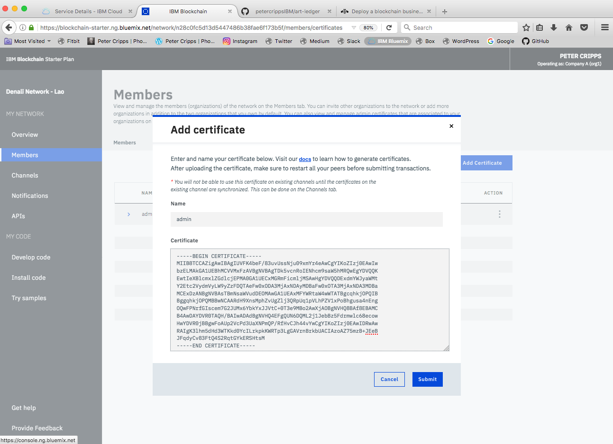
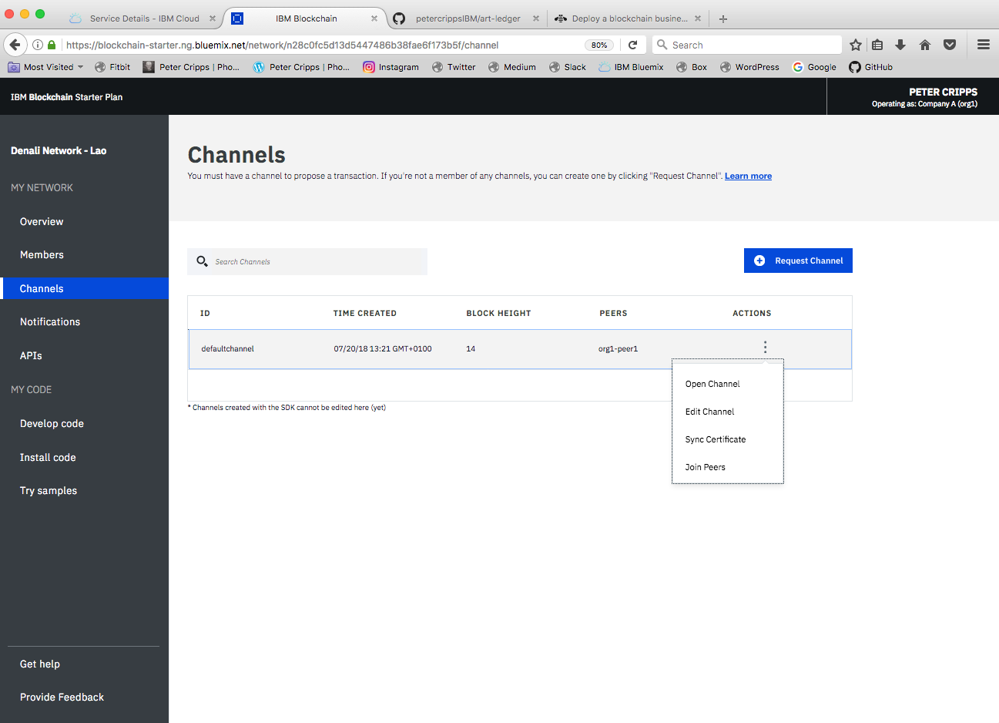

# Step 4: Create Business Network Artefacts
In this step we will create the required artefacts that are needed for our blockchain network. We will be using the `composer` command line tool that we downloaded previously. Esentially there are two types of artefact we need.

A *Business Network Card* provides all of the information needed to connect to a blockchain business network. It is only possible to access a blockchain business network through a valid Business Network Card. A Business Network Card contains an *Identity* for a single *Participant* within a deployed business network. You can have multiple Business Network Cards for a single deployed business network, where those Business Network Cards belong to multiple Participants.

Before a business network definition can be deployed it must be packaged into a *Business Network Archive* file. The composer `archive create` command is used to create a business network archive file from a business network definition folder on disk. These will be the artefacts created earlier consisting of model, logic and permissions files.

Remember to substitute the name of your own network at the appropriate points when executing the commands in these steps. Remember also to make sure you are in the project root directory before executing any of the following commands.

## Step 4.1: Create the CA Card
First we create the *Certiicate Authority* (CA) card.
```
$ composer card create -f ca.card -p connection-profile.json -u admin -s <your-enrollSecret>
```
You obtain `<your-enrollSecret>` from the `connection-profile.json` created earlier. Open that file and search for `enrollSecret` then copy the secret itself onto the command line. Next import the newly created card as shown:
```
$ composer card import -f ca.card -c ca
```
Check the CA card is created by issuing the command:
```
$ composer card list
```
Finally request the valid public/private keys for the admin from the Certificate Authority using:
```
$ composer identity request --card ca --path ./credentials
```
This should result in a new directory `credentials` being created with three `.pem` files.

## Step 4.2: Add a Certificate to the IBM Starter Plan
The certificate you require is in the file `admin-pub.pem` in the directory `credentials`. Copy the entire contents of that file (including the `-----BEGIN CERTIFICATE-----` and `-----END CERTIFICATE-----` lines) to the clipboard.

Next go to the Network Monitor for your blockchain network on IBM Cloud Starter Plan, select `Members` then `Certificates` and `Add Certificate`. Name the certificate `admin` then paste the certificate into the field as shown and select `Submit`.



Next you need to sync the newly added certificate across channels by slecting `Channels`, `Synchornize` then `Submit`



## Step 4.3:
```
$ composer network install -c adminCard -a art-ledger-0.0.1.bna
$ composer network start -c adminCard -n art-ledger -V 0.0.1 -A admin -C ./credentials/admin-pub.pem -f delete_me.card
```

## Step 4.4:
```
$ composer card create -n art-ledger -p ./connection-profile.json -u admin -c ./credentials/admin-pub.pem -k ./credentials/admin-priv.pem
$ composer card import -f admin@art-ledger.card
```

## Step 4.5: Create Business Network Archive
Before creating the business network archive (`.bna`) file you'll need to tweak the **permissions.acl** file. The ones you get by default probably won't be compatible with changes you'll have added in the model file. If you get that problem then paste the contents of [this file](https://github.com/petercrippsIBM/art-ledger/blob/master/archive/permissions-v0.0.1.acl) **permissions.acl** into the one in the project directory.

At this point if you check the block height of your channel you should see it set at '4' meaning there are four blocks in your network corresponding to:
* 0 - the GENESIS block
* 1 - addition of the certificate
* 2 - instantiation of the chaincode
* 4 - invocation of the chaincode

You can check the network is up and running by issuing a ping command:
```
$ composer network ping -c admin@art-ledger
```
This will return some information about the network including the version number of the network composer runtime (o.19.5 if you've been using the same version numbers in these instructions) and your network (0.0.1).

You can also check your `composer-wallets` Cloudant database where you should see the three cards that have been created.

Now go to [Step 5: Expose and Test REST APIs](../docs/05%20REST%20APIs.md).
